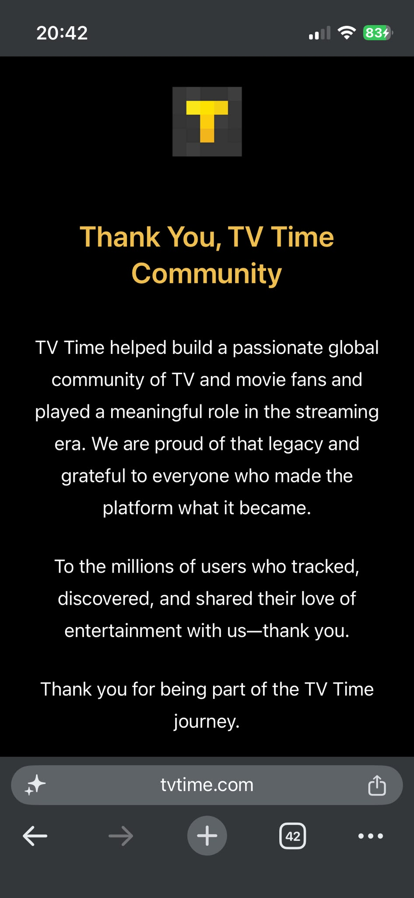

# TV Time

A subscription-first SwiftUI prototype for following upcoming TV episodes.

## Motivation

This project began after the announcement that TV Time would shut down on July 15, 2026. Whip Media said the free consumer app was no longer sustainable, while [TechCrunch reported that the company was shifting its focus toward enterprise AI products](https://techcrunch.com/2026/07/02/popular-tv-tracking-app-tv-time-is-shutting-down-as-company-focuses-on-ai/).

For people who depended on TV Time to remember what airs next, the loss is practical as much as nostalgic. This prototype asks a simple question: can a small, subscription-first iOS app preserve that core experience with free public data sources, a fast chronological feed, and local-first tracking?

This is an independent prototype and is not affiliated with or endorsed by TV Time or Whip Media.

## Screenshots

| The shutdown notice | A subscription-first rebuild |
| --- | --- |
|  |  |

## Open

1. Open `TVTime.xcodeproj` in Xcode 16 or newer.
2. Choose an iPhone simulator.
3. Run the `TVTime` scheme.

The prototype uses sample schedule data and bundled TVmaze poster images. Subscriptions and watched episodes persist in `UserDefaults`.

## Product shape

- **Shows**: one combined TV and movie timeline with a media-type filter; pull firmly past the top to load previous subscribed seasons on demand.
- **Theme music**: automatically shuffle matching 30-second soundtrack previews across the subscribed lineup, including a large WWE and wider pro-wrestling entrance theme pool, controlled by a single on/off preference in Profile.
- **Discover**: browse daily-changing trending and personalized recommendation carousels, filter by content type and streaming service, or search TVmaze and Apple's movie catalog, then subscribe with one tap.
- **Profile**: manage subscriptions and watched episodes, see total watch time, and control reminders, appearance, and local data.

TV and anime search results plus episode schedules come from TVmaze's free public API. Movie search and metadata use Apple's public Search API. The browse grid also includes a curated starter set of films and anime.
