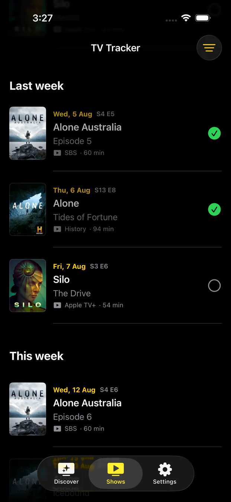
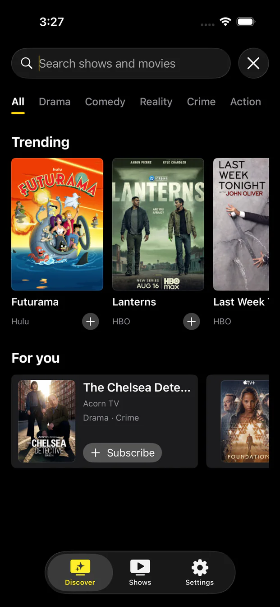
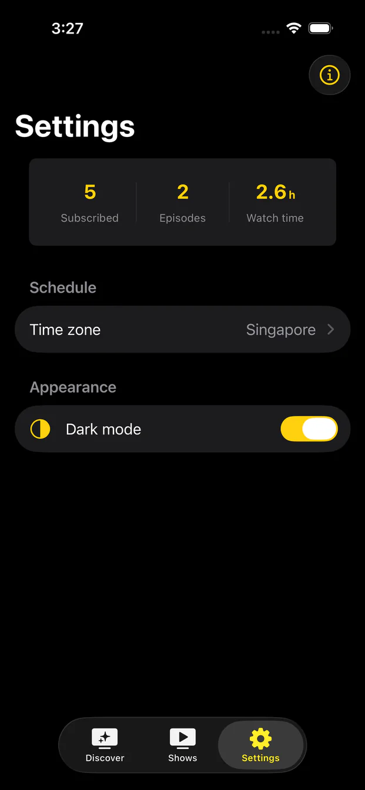

# TV Tracker

Never miss the next episode of your shows.

TV Tracker is a SwiftUI app built around one fast chronological list. People subscribe to the shows they care about, see confirmed upcoming dates in their chosen time zone, and mark episodes as watched.

## Screenshots

  
  
  
  

## Motivation

This project began after the announcement that TV Time would shut down on July 15, 2026. [TechCrunch reported that the company was shifting its focus toward enterprise AI products](https://techcrunch.com/2026/07/02/popular-tv-tracking-app-tv-time-is-shutting-down-as-company-focuses-on-ai/).

TV Tracker is an independent product and is not affiliated with or endorsed by TV Time or Whip Media.

## Product

- **Shows** presents subscribed TV episodes and movie releases in one chronological list.
- **Discover** searches a broad global TV catalogue, including anime, and surfaces current broadcast and streaming titles.
- **Settings** manages subscriptions, watched history, time zone, appearance, support, and legal information.
- Subscriptions and watched history stay private and automatically sync through the user's iCloud account for reinstall recovery. TV Tracker has no separate account, advertising, analytics, or tracking SDK.

TV information and schedule data are provided by [TVmaze](https://www.tvmaze.com) under CC BY-SA. Additional catalogue coverage may be provided by TMDB. This product uses the TMDB API but is not endorsed or certified by TMDB.

## Privacy And Support

- [Privacy Policy](PRIVACY.md)
- [Support](SUPPORT.md)
